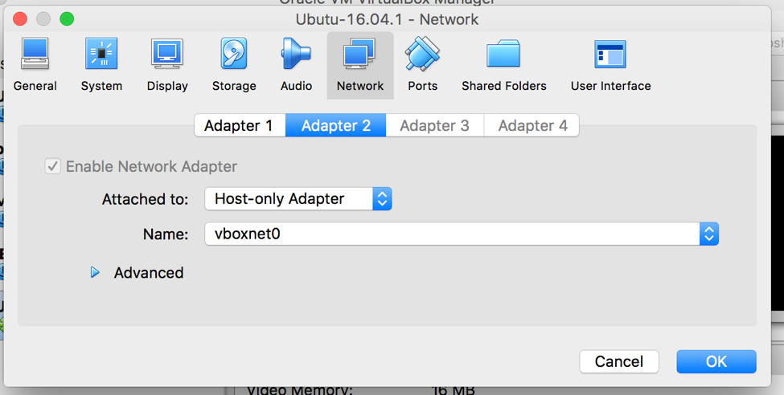

Create G-OnRamp Virtual Machine Image
===================================

Requirements
------------

1. Download and install Virtual Box => https://www.virtualbox.org
2. Download Ubuntu Server 16.04.1 LTS => https://www.ubuntu.com/download/server

Step by step instruction
-------------------------
1. Install Ubuntu server to the VirtualBox
******************************************
See `How to Install Ubuntu on VirtualBox <http://tecadmin.net/install-ubuntu-on-virtualbox/>`_

Additional settings when installing the Ubuntu

- Hostname: ubuntus
- Full name: galaxy
- User name: galaxy
- password: 2016
- Use entire disk and set up LVM
- No proxy configured
- Install security updates automatically
- Install LAMP server, PostgreSQL database, OpenSSH server
- Create new GRUB boot loader
  
2. Initial Ubuntu setup
***********************
Start the Ubuntu and login in to update the system.

Update packages:: 
 
  $ sudo apt-get update
  $ sudo apt-get -u upgrade
  
Check for additional updates after reboot::

  $ reboot
  $ sudo apt-get update
  $ apt-get --with-new-pkgs upgrade
  $ reboot
  
Install dependencies::

  $ sudo apt-get install build-essential
  $ sudo apt-get install cmake
  $ sudo apt-get install zlib1g-dev  

3. Set up internet host-only adapter (used to connect guest VM from host by ssh)
********************************************************************************
Shutdown the virtual machine and add vboxnet0 to Adapter 2 as Host-only Adapter. Then restart the virtual machine. 

On the host, type command::

$ ifconfig

Find the vboxnet0 ip::

    vboxnet0: flags=8943<UP,BROADCAST,RUNNING,PROMISC,SIMPLEX,MULTICAST> mtu 1500
    ether 0a:00:27:00:00:00
    inet 192.168.56.1 netmask 0xffffff00 broadcast 192.168.56.255

On the Ubuntu guest, list interfaces by typing the command::

$ ip addr

You should see three interfaces like lo, enp0s3, enp0s8. We will use the third. 

Edit the interfaces file by::

$ cd /etc/network/interfaces

Add following enp0s8 configuration to the file::

    auto enp0s8
    iface enp0s8 inet static
    address 192.168.56.11
    netmask 255.255.255.0

Then activate the interface::

$ sudo ifup enp0s8

Check if enp0s8 got correct address. You should see your ip by typing::

    $ ip addr show enp0s8
     ...
    inet 192.168.56.11/24 brd 192.168.56.255 scope global secondary enp0s8

If not correct, you may run::

$ sudo ifdown enp0s8 
$ sudo ifup enp0s8
$ reboot

Now you can access to Ubuntu guest through host by::

$ ssh galaxy@192.168.56.11

4. Install galaxy
*****************
Galaxy requires a few things to run: a virtualenv, configuration files and dependent python modules. Starting the server at the first time will set these thing up. 

Download Galaxy 16.07::

$ git clone -b release_16.07 https://github.com/galaxyproject/galaxy.git

Install python::

$ sudo apt-get install python

Run Galaxy::

$ cd galaxy
$ sh run.sh

5. Set up proxy
***************
Set up the proxy to allow access to the Galaxy from the Browsers on the host.

Enable proxy modules for apache::

$ a2enmod proxy proxy_ajp proxy_http rewrite deflate headers proxy_balancer proxy_connect proxy_html
$ service apache2 restart

Make a new web server config file for Galaxy::

$ cd /etc/apache2/sites-available/
$ cp 000-default.conf 001-galaxy.conf
$ sudo vim 001-galaxy.conf

Add the following lines between <VirtualHost></VirtualHost> to /etc/apache2/sites-available/001-galaxy.conf::

    <Proxy *>
        Order deny,allow
        Allow from all
    </Proxy>
    ProxyPreserveHost On
    <Location "/gonramp">
        ProxyPass "http://192.168.56.11:8080/"
        ProxyPassReverse "http://192.168.56.11:8080/"
    </location>
    RewriteEngine on
    RewriteRule ^/gonramp$ /gonramp/ [R]
    RewriteRule ^/gonramp/static/style/(.*) /home/galaxy/galaxy/static/june_2007_style/blue/$1 [L]
    RewriteRule ^/gonramp/static/scripts/(.*) /home/galaxy/galaxy/static/scripts/packed/$1 [L]
    RewriteRule ^/gonramp/static/(.*) /home/galaxy/galaxy/static/$1 [L]
    RewriteRule ^/gonramp/favicon.ico /home/galaxy/galaxy/static/favicon.ico [L]
    RewriteRule ^/gonramp/robots.txt /home/galaxy/galaxy/static/robots.txt [L]
    RewriteRule ^/gonramp(.*) http://192.168.56.11:8080$1 [P]

Enable the new site, disable the default site and reload the apache::

$ a2ensite 001-galaxy.conf
$ a2dissite 000-default.conf
$ service apache2 reload

6. Set up Galaxy
****************

Set proxy
#########

Galaxy application needs to be aware that it is running with a prefix (for generating URLs in dynamic pages). This is accomplished by configuring a Paste proxy-prefix filter in the [app:main] section of config/galaxy.ini and restarting Galaxy::
  
  [server:main]
    host = 192.168.56.11
  [filter:proxy-prefix]
    use = egg:PasteDeploy#prefix
    prefix = /gonramp
  [app:main]  
    filter-with = proxy-prefix
    cookie_path = /gonramp

Become an Admin
###############
In order to install tools, you have to become administrator for your Galaxy instance. First start the server, go to http://192.168.56.11:8080/gonramp, and register as a new user with your email address. 
  
Go to galaxy folder and find a sub-folder called config. Add a new file named galaxy.init in the config folder. You can copy the content of galaxy.init.sample into galaxy.init. In galaxy.init, search for the line containing “admin_users”. Add your user email address to admin users. (Replace None to your email address). You can add multiple admin users by appending another email and separating them with a comma::
  
  # this should be a comma-separated list of valid Galaxy users
  admin_users = None
  
Set up conda
############

In galaxy.init, uncomment and edit the following conda configuration::

  conda_ensure_channels = conda-forge,r,bioconda,iuc
  conda_auto_install = True
  conda_auto_init = True
  
Connect your Galaxy to the test tool shed
#########################################

Galaxy is connected to the Main Tool Shed by default. Since some tools in G-OnRamp workflow are in the Test Tool Shed, you need to connect to the Test Tool Shed by modifying the “tool_sheds_conf.xml” in config folder::

  # Copy the “tool_sheds_conf.xml.sample” and rename it to “tool_sheds_conf.xml”
  $ cd /home/galaxy/config
  $ cp tool_sheds_conf.xml.sample tool_sheds_conf.xml
  # Open the file 
  $ vim tool_sheds_conf.xml

Uncomment the lines for the Test Tool Shed::
  
  <?xml version="1.0"?>
  <tool_sheds>
    <tool_shed name="Galaxy Main Tool Shed" url="https://toolshed.g2.bx.psu.edu/"/>
  <!-- Test Tool Shed should be used only for testing purposes.
    <tool_shed name="Galaxy Test Tool Shed" url="https://testtoolshed.g2.bx.psu.edu/"/> 
  -->
  </tool_sheds>
  
To::

  <?xml version="1.0"?>
  <tool_sheds>
    <tool_shed name="Galaxy Main Tool Shed" url="https://toolshed.g2.bx.psu.edu/"/>
    <tool_shed name="Galaxy Test Tool Shed" url="https://testtoolshed.g2.bx.psu.edu/"/> 
  </tool_sheds>
  
Add necessary datatypes
#######################

Copy the “datatypes_conf.xml.sample” and rename it to “datatypes_conf.xml”.
Add the line below in between <registration></registration>::

  <datatype extension="psl" subclass="True" type="galaxy.datatypes.tabular:Tabular" />

Other files should be ready (copy from .sample)
################################################
::

  $ cp dependency_resolvers_conf.xml.sample dependency_resolvers_conf.xml
  
Restart the server after you modified the configuration files. You can hit Ctrl-c to stop the server and then start again.

7. Install G-OnRamp tools
*************************

Go to Admin page, and click on Search Tool Shed. Click on the Tool Sheds to search and install. You can add all G-OnRamp tools in a separate panel section by adding a new tool panel section when you install the first tool and then add all the rest tools in the same panel. 

Click on Galaxy Main Tool Shed to install
#########################################

- ncbi_blast_plus (by devteam)
- Augustus 
- HISAT2
- StringTie (1.1.0)
- blastXmlToPsl 
- TrfBig 
- pslToBed 
- bamtobigwig
- hubarchivecreator 
- multi_fasta_glimmer_hmm

Click on Galaxy Test Tool Shed to install
#########################################

- snap

Tools need advanced configuration
#################################

1. multi_fasta_glimmer_hmm

Make a Dependencies folder in "/home/galaxy" and download Glimmer3 inside the folder by::

  $ mkdir Dependencies
  $ cd ~/Dependencies
  $ wget ftp://ccb.jhu.edu/pub/software/glimmerhmm/GlimmerHMM-3.0.4.tar.gz

Rename glimmerhmm executable file (glimmerhmm_linux_x86_64) to glimmerhmm and then add glimmerhmm to the path (in .bashrc).

You also need to use a trained organism by adding them as reference data in Galaxy:

Add the glimmer_hmm_trained_dir data table to tool_data_table_conf.xml in $GALAXY_ROOT/config/::

  <!-- glimmer_hmm trained_dir -->
  <table name="glimmer_hmm_trained_dir" comment_char="#">
    <columns>value, name, path</columns>
    <file path="tool-data/glimmer_hmm.loc" />
  </table>

  
  

Add the glimmer_hmm.loc file referencing your trained organism, in tool-data. Uncomment the species and add the path to trained_dir. 

2. TrfBig

Because trf executable file is not renamed to trf successfully, so it needs to be renamed manually.
 
Go to installation path of trf::

  $ cd /home/galaxy/galaxy/database/dependencies/trf/4.07b/rmarenco/trfbig/e45bd0ffc1a4/bin
  $ mv trf407b.linux64 trf

3. Bam to Bigwig

libstdc++.so.6: version `GLIBCXX_3.4.20' not found, maybe because it is not using the right libstdc++.so.6. Delete the installed libstdc++.so.6 in the tool dependencies, so that the tool can use the system version of libstdc++.so.6::

  $ cd /home/galaxy/galaxy/database/dependencies/ucsc_tools/312/iuc/package_ucsc_tools_312/2d6bafd63401/lib/
  $ rm libstdc++.so.6

  

  

 

 
  
   
  

  

  
  

   

    

  
  
  

